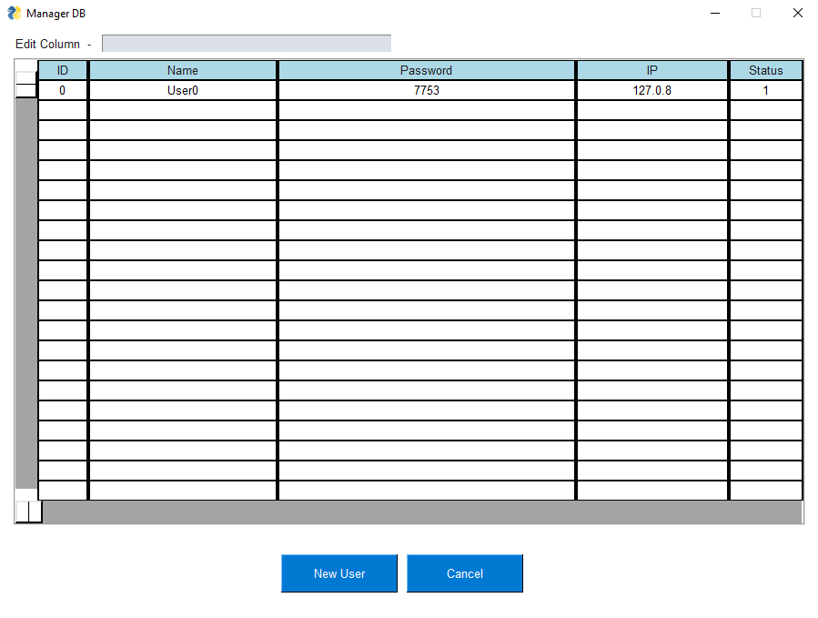

# PySimpleGuiUix

<!---Esses são exemplos. Veja https://shields.io para outras pessoas ou para personalizar este conjunto de escudos. Você pode querer incluir dependências, status do projeto e informações de licença aqui--->

> Comecei a fazer essa lib para quem trabalha com PySimpleGUI e quer um opouco mais
> de facilidade, veja os exemplos em "examples/" para entender melhor.

### Ajustes e melhorias

O projeto ainda está em desenvolvimento e as próximas atualizações serão voltadas nas seguintes tarefas:

- [x] Popups customizaveis
- [x] Window Callback's
- [x] Table date
- [ ] Terminal widget
- [ ] Scrollview Widget

## 💻 Pré-requisitos

Antes de começar, verifique se você atendeu aos seguintes requisitos:
<!---Estes são apenas requisitos de exemplo. Adicionar, duplicar ou remover conforme necessário--->
* Você instalou o `Python >= 3.9.7`.
* Você tem uma máquina `Windows / Linux / Mac`.

## 🚀 Instalando o PySimpleGuiUix

Basta mover o essa pasta para dentro de "site-packages" no Python,
não certificar que o nome da pasta é "PySimpleGuiUix"

## 📫 Contribuindo para o PySimpleGuiUix
<!---Se o seu README for longo ou se você tiver algum processo ou etapas específicas que deseja que os contribuidores sigam, considere a criação de um arquivo CONTRIBUTING.md separado--->

1. Bifurque este repositório.
2. Crie um branch: `git checkout -b dev`.
3. Faça suas alterações e confirme-as: `git commit -m '<mensagem_commit>'`
4. Envie para o branch: `git push origin dev`
5. Crie a solicitação de pull.

Como alternativa, consulte a documentação do GitHub em [como criar uma solicitação pull](https://help.github.com/en/github/collaborating-with-issues-and-pull-requests/creating-a-pull-request).

## 🤝 Colaboradores

Agradecemos às seguintes pessoas que contribuíram para este projeto:

<table>
  <tr>
    <td align="center">
      <a href="#">
         
        
          <b>Heitor Tasso</b>
        
      </a>
    </td>
    <td align="center">
      <a href="#">
         
        
          <b>Mark Zuckerberg</b>
        
      </a>
    </td>
    <td align="center">
      <a href="#">
         
        
          <b>Steve Jobs</b>
        
      </a>
    </td>
  </tr>
</table>

## 📝 Licença

Esse projeto está sob licença. Veja o arquivo [LICENÇA](LICENSE.md) para mais detalhes.

[⬆ Voltar ao topo](#PySimpleGuiUix) 
